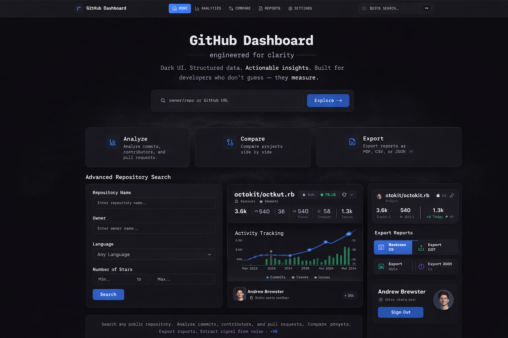

# GitHub Dashboard Tracker

> Real-time repository intelligence for developers who measure, not guess.



**[Live Demo →](https://github-dashboard-beige.vercel.app)**

---

## The Problem

GitHub's native analytics are scattered across 4+ tabs and reset after 30 days.

Developers managing multiple repositories waste 15+ minutes daily switching between Insights, Issues, PRs, and commit history — with no way to compare repositories side by side or export data for stakeholders.

This dashboard centralises everything into a single, fast interface.

---

## What It Does

| Feature | Detail |
|---|---|
| **Repository Analysis** | Commits, contributors, PRs, issues — one view |
| **Cross-repo Comparison** | Side-by-side metrics across multiple repositories |
| **Activity Tracking** | Commit velocity trends beyond GitHub's 30-day limit |
| **PDF / CSV / JSON Export** | Stakeholder-ready reports in one click |
| **Real-time Sync** | GitHub webhook integration + manual refresh |
| **Saved Repositories** | Bookmark repos for instant access |

---

## Technical Highlights

**Architecture decisions worth noting:**

- **Next.js 16 App Router** — server components for optimal Time to First Byte
- **PostgreSQL + Prisma** — optimised indexing for sub-100ms query response
- **In-memory cache with TTL** — reduces GitHub API calls, handles rate limits gracefully
- **Exponential backoff** — retry logic on all Octokit API calls
- **Zod validation** — type-safe API routes end to end
- **NextAuth.js v5** — GitHub OAuth with secure session handling
- **44 tests passing** — components, integration, hooks, auth flows

---

## Stack

```
Frontend:  Next.js 16 · React · TypeScript · Tailwind CSS v4
UI:        shadcn/ui · Radix UI · Recharts
Backend:   Next.js API Routes · Prisma ORM · PostgreSQL (Neon)
Auth:      NextAuth.js v5 (GitHub OAuth)
API:       Octokit (GitHub REST API v3)
Testing:   Jest · React Testing Library (44 tests, 6 suites)
Export:    jsPDF
Deploy:    Vercel
```

---

## Quick Start

```bash
git clone https://github.com/kapsarovL/github-dashboard-tracker
cd github-dashboard-tracker
npm install
cp .env.local.example .env.local
```

Required environment variables:

```bash
DATABASE_URL=           # Neon PostgreSQL connection string
AUTH_GITHUB_ID=         # GitHub OAuth Client ID
AUTH_GITHUB_SECRET=     # GitHub OAuth Client Secret
AUTH_SECRET=            # openssl rand -base64 32
GITHUB_TOKEN=           # GitHub Personal Access Token
GITHUB_WEBHOOK_SECRET=  # Webhook secret (optional)
```

```bash
npm run db:push
npm run db:generate
npm run dev
```

---

## Testing

```bash
npm test                 # Run all 44 tests
npm run test:coverage    # Coverage report
```

**Coverage includes:**
- Component rendering (React Testing Library)
- API route integration
- Custom React hooks
- Authentication flows
- Database operations

---

## Project Structure

```
├── app/
│   ├── api/          # Auth, repos, webhooks
│   ├── actions/      # Server actions
│   ├── dashboard/    # Dashboard pages
│   └── hooks/        # Custom React hooks
├── lib/
│   ├── cache/        # In-memory cache with TTL
│   ├── db/           # Prisma client & services
│   ├── webhooks/     # GitHub webhook handlers
│   └── github.ts     # Octokit API client
├── prisma/
│   └── schema.prisma
└── types/
```

---

## Deployment

Deployed on Vercel. One-click deploy:

[](https://vercel.com/new/clone?repository-url=https://github.com/kapsarovL/github-dashboard-tracker)

---

## License

MIT — see [LICENSE](./LICENSE)

---

Built by [Lazar Kapsarov](https://lazarkapsarov.com)  
→ contact@lazarkapsarov.com · [LinkedIn](https://linkedin.com/in/kapsarov-lazar)
